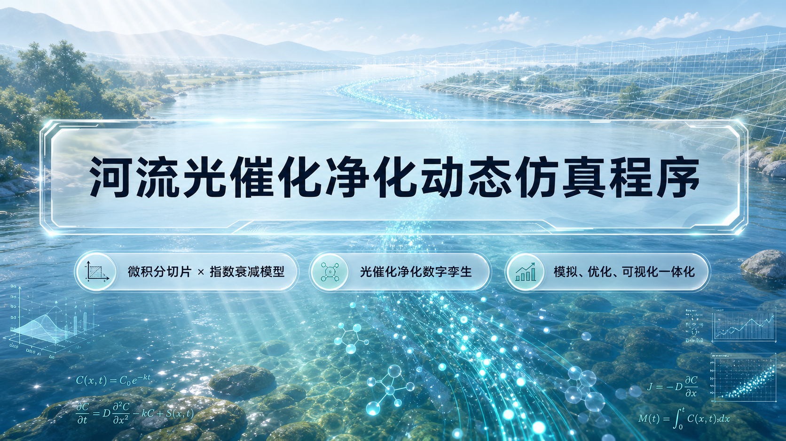

# 🌊 基于微积分切片思想与指数衰减模型的河流光催化净化动态仿真程序
### River Photocatalytic Purification Digital Twin System

<p align="left">
  <a href="https://floss.cc.cd/"></a>
  
  
  
  
  
  
  
  
  
</p>

<p align="center">
  <a href="https://floss.cc.cd/">
    
  </a>
</p>

---

## 🌐 在线交互演示平台与项目关联说明 / Live Platform & Project Correlation

本项目配套建设了公网在线交互演示平台：**[https://floss.cc.cd/](https://floss.cc.cd/)**

### 网站与本开源项目的关联性 / How the Website Relates to This Project

* **数理模型的线上实验台**：线上网站是本仓库所推导的“微积分切片离散积分模型”与“指数衰减光催化动力学模型”的完整工程化落地展示端。
* **零门槛即时推演**：无需在本地下载代码或配置 Python / Node.js 运行环境，评委与研究者可通过现代浏览器直接体验 60 FPS 动态河流流场渲染、污染物热力渐变及水力学参数调节。
* **双引擎求解验证**：网站前台支持浏览器本地 TypeScript 轻量级物理求解，后台无缝接入本仓库中的 FastAPI 科学计算微服务（内置 NumPy 向量化矩阵运算与 Nelder-Mead 帕累托投药寻优算法）。
* **多工况学术预设**：在线网站集成了澜沧江夏季暴雨、苏州河工业超标等典型真实流域治理场景，方便直观验证不同流速、水深与光照条件下的水质净化效果。

---

## 📖 项目简介 / Overview

### 中文说明
在实际水环境治理中，半导体光催化材料（如 $\text{TiO}_2$ 等）的工程化应用常常面临核心痛点：**“催化剂投在河道何处？投放多少剂量？在多变流速、光照与水深下能否稳定达标？如何权衡药剂成本与净化收益？”**

本项目是一个跨学科的**河流光催化净化数字孪生仿真系统**。它将**水力学连续性、化学反应动力学、环境光学衰减模型与微积分切片（Riemann Slicing）离散积分算法**深度耦合，构建了一个高度可调、毫秒级即时推演、支持智能决策的数字孪生交互实验台。系统不仅能直观呈现复合污染物在多变河道中的空间扩散与动态衰减过程，更通过**帕累托前沿寻优算法（Pareto Optimization）**，为流域治理提供“最少投药次数、最优投放坐标、最低药剂成本”的定量科学决策支持。

### English Overview
In real-world aquatic environmental engineering, deploying semiconductor photocatalytic materials (e.g., $\text{TiO}_2$) poses significant practical challenges: **"Where along the river course should catalysts be placed? What dosage is required? Can water quality standards be reliably achieved under fluctuating velocities and depths? How do we strike an optimal balance between reagent costs and decontamination efficacy?"**

This project establishes an interdisciplinary **Digital Twin Simulation System for River Photocatalytic Remediation**. By tightly coupling **fluid continuity, chemical reaction kinetics, environmental optical attenuation (Beer-Lambert Law with dynamic NTU feedback), and Riemann slice numerical discretization**, it provides an interactive, high-fidelity platform capable of instant 60 FPS real-time simulation.

Beyond forward dynamic modeling, the system features an automated **Pareto Frontier Optimization solver** (greedy grid search paired with Nelder-Mead simplex refinement). It mathematically computes optimal dosing strategies (minimal dosing frequency, precise spatial coordinates, and customized dosages) to satisfy regulatory criteria (such as China's **GB 3838-2002 Class I surface water standards**) with maximum cost-effectiveness.

---

## ✨ 核心特性 / Key Features

### 1. 物理-化学复合高保真数理模型 / Multi-Physics Coupled Modeling
* **微积分切片思想 / Riemann Slicing**：
  * 将非均质河流沿流向细分微元切片 $\Delta x$，严密计算水流停留时间 $\Delta t = \Delta x / v$。
  * Discretizes inhomogeneous river channels into micro-slices $\Delta x$ along the streamline, strictly calculating hydraulic residence time $\Delta t = \Delta x / v$.
* **一级反应动力学与指数衰减 / First-Order Degradation Kinetics**：
  * 基于 $C(t) = C_0 \cdot e^{-k \cdot \Delta t}$ 推演浓度变化，反应速率由有效光强、催化剂活性与投药比动态确定。
  * Evaluates concentration decay via $C(t) = C_0 \cdot e^{-k \cdot \Delta t}$, dynamically parameterized by effective light intensity, catalyst activity, and dose ratio.
* **朗伯-比尔光衰减与浊度负反馈 / Lambert-Beer Attenuation & Dynamic NTU Feedback**：
  * 光强随水深与水体浊度指数衰减，且浊度与瞬时污染物浓度非线性耦合，真实复现高污染区域光穿透受阻的动力学抑制效应。
  * Light intensity decays exponentially through water depth and turbidity, with NTU coupled to instantaneous concentration—faithfully recreating photopenetration inhibition.
* **水力学截面守恒 / Hydraulic Cross-Section Conservation**：
  * 严格遵循 $Q = v \cdot w \cdot d = \text{const}$，支持河道变宽、变窄、拐弯以及湖泊滞水区的流速自适应响应。
  * Enforces discharge conservation $Q = v \cdot w \cdot d = \text{const}$, accurately modeling velocity adaptations across narrows, bends, and lake stagnation zones.
* **多元污染与复杂工况 / Multi-Pollutant Profiling & Discharge Modes**：
  * 支持点源连续排污（Continuous）与突发瞬时排污（Burst），涵盖有机大分子、重金属、石油烃、微塑料等 6 种典型水体污染物。
  * Accommodates both continuous point-source and instantaneous burst discharges across 6 pollutant classes (organics, heavy metals, hydrocarbons, microplastics, etc.).

### 2. 智能投药帕累托寻优 / Intelligent Pareto Optimal Dosing
* **混合寻优算法 / Hybrid Optimization Algorithm**：
  * 内置贪心序列网格搜索（Global Grid Search）+ Nelder-Mead 单纯形局部精修算法（Simplex Refinement）。
  * Combines global greedy sequential grid search with local Nelder-Mead simplex refinement for multi-variable non-linear optimization.
* **GB 3838-2002 达标求解 / Regulatory Water Quality Compliance**：
  * 自动计算在达到地表水环境质量标准（I 类水标准 $C < 10\%$）前提下的最优投药点数量、空间坐标与推荐剂量，生成帕累托前沿权衡曲线。
  * Automatically computes the minimal dosing count, precise spatial coordinates, and optimal doses to meet GB 3838-2002 Class I water standards ($C < 10\%$).

### 3. 双引擎自适应计算架构 / Dual-Engine Adaptive Architecture
* **前端轻量引擎 / Client-Side TS Engine**：
  * 数值算法采用 TypeScript 纯前端本地运行，用户拖动滑块时无需网络请求即可享受 60 FPS 毫秒级即时推演。
  * Pure TypeScript numerical engine running 100% in the browser, enabling zero-latency 60 FPS slider interactions without network dependency.
* **后端高性能微服务 / High-Performance Backend Microservice**：
  * 基于 FastAPI + NumPy/SciPy 构建，提供高并发矩阵并行仿真与帕累托优化接口，支持场景持久化存储。
  * Built with FastAPI and NumPy/SciPy, offering high-throughput vectorized simulation, multi-scenario evaluation, and database persistence.

### 4. Apple Liquid Glass 视觉控制台 / Apple Liquid Glass Aesthetic
* 遵循现代液态玻璃（Liquid Glass）视觉系统设计：通透毛玻璃、环境折射高光、浅色水雾蓝绿渐变与高精密数据 HUD。
* Crafted under the modern Apple Liquid Glass design system: translucent frosted glass, refractive caustic highlights, ambient mist gradients, and crisp HUD meters.
* HTML5 Canvas 2D 粒子流引擎，清晰渲染河流流向、流速矢量与污染物浓度热力渐变。
* HTML5 Canvas 2D particle simulation rendering streamline vectors, velocities, and dynamic concentration heatmaps.

### 5. 多人实时协同观察室 / Multi-User Real-Time Collaboration
* 内置 WebSocket 房间管理系统，支持多端、多人同时进入同一河流仿真会话，实现参数调节与仿真过程的多人实时同屏推演。
* Integrated WebSocket room infrastructure enabling real-time multi-client synchronization for classroom demonstrations and collaborative team modeling.

---

## 🔬 数学建模原理 / Mathematical Formulation

```text
       河水流入 / Inflow                                           河水流出 / Outflow
    ───────►   ┌─────────────────┐       ┌─────────────────┐   ───────►
      C_in     │  切片微元 Δx_1  │ ───►  │  切片微元 Δx_n  │     C_out
               │  停留时间 Δt_1  │       │  停留时间 Δt_n  │
               └─────────────────┘       └─────────────────┘
                        ▲                         ▲
                        │ 光照 / Light I_eff       │ 催化剂 / Catalyst k
```

1. **切片停留时间 / Residence Time per Slice**：
   $$\Delta t = \frac{\Delta x}{v}$$
2. **光解与催化衰减动力学 / Photodegradation Kinetics**：
   $$C_{\text{out}} = C_{\text{in}} \cdot \exp\left(-k \cdot \Delta t\right)$$
   $$k = \eta_{\text{catalyst}} \cdot r_{\text{dose}} \cdot I_{\text{eff}} + k_{\text{natural}}$$
3. **有效光强（朗伯-比尔定律耦合动态浊度）/ Effective Light Attenuation**：
   $$I_{\text{eff}} = I_0 \cdot \exp\left(-\alpha \cdot d\right), \quad \alpha = \alpha_0 + \beta \cdot \text{NTU}$$
4. **水流连续性方程 / Fluid Continuity Equation**：
   $$Q = v \cdot w \cdot d = \text{const} \implies v = \frac{Q}{w \cdot d}$$

---

## 🛠️ 技术栈 / Tech Stack

| 模块 / Module | 核心技术 / Technologies | 说明 / Description |
| :--- | :--- | :--- |
| **在线交互平台 / Live Platform** | Cloudflare CDN + SSL | 官方在线运行节点：[floss.cc.cd](https://floss.cc.cd/) |
| **前端框架 / Frontend** | React 19 + TypeScript + Vite 6 | 高响应性现代前端单页架构 / High-responsiveness modern SPA |
| **视觉与样式 / Styling** | Tailwind CSS 4 + Liquid Glass CSS | 现代苹果液态玻璃 UI 规范 / Apple Liquid Glass design system |
| **数据可视化 / Visualization** | HTML5 Canvas 2D + Chart.js | 河流粒子动画、浓度热力图与数据仪表盘 / Canvas 2D particle engine & charts |
| **后端微服务 / Backend** | Python 3.10+ / FastAPI / Uvicorn | 异步高性能微服务 / Async high-throughput microservice |
| **科学计算 / Computation** | NumPy / SciPy | 向量化切片数值积分与单纯形优化 / Vectorized numerical integration & optimization |
| **数据存储 / Database** | SQLAlchemy (Async) + SQLite | 场景预设快照与仿真实验记录 / Scenario snapshots & simulation run history |
| **实时通讯 / WebSocket** | WebSockets (RFC 6455) | 多人协同观察室实时广播 / Real-time room broadcast for multiplayer observation |
| **容器化 / Container** | Docker + Docker Compose + GHCR | 跨平台一键部署镜像分发 / Cross-platform containerized image distribution |

---

## 🚀 快速启动与本地运行指南 / Getting Started & Local Setup

如果你需要在本地自行运行或进行二次开发，可选择以下方式：

### 1. Docker 一键本地运行 / Option 1: One-Command Docker Run (Recommended)

无需配置任何本地编程语言环境，直接通过 GitHub Packages (GHCR) 镜像一键启动全栈系统：  
Run the full-stack system instantly via our prebuilt GitHub Packages container:

```bash
# 方式 A / Option A: Docker CLI 快速启动
docker run -d -p 80:80 --name river-twin ghcr.io/pinzhuo0905-rgb/river-purification-digital-twin:latest

# 方式 B / Option B: Docker Compose 本地编排
docker compose up -d
```

启动后在浏览器打开 / Open in browser: `http://localhost`

---

### 2. 本地源码启动前端 / Option 2: Local Frontend Setup (React + Vite)

仅需运行前端即可完整体验纯前端数值仿真引擎：  
Experience the complete client-side numerical simulation engine without backend dependencies:

```bash
# 1. 安装前端依赖 / Install dependencies
npm install

# 2. 启动前端热重载开发服务器 / Start Vite dev server
npm run dev
```

启动后在浏览器打开 / Open in browser: `http://localhost:5173`

---

### 3. 本地源码启动后端 / Option 3: Local Backend Setup (FastAPI + Python)

用于支持场景持久化存储、多人协同观察室与后端大规模并行计算：  
Enables scenario persistence, multi-user WebSocket rooms, and NumPy high-precision solver:

```bash
# 1. 进入后端目录 / Navigate to backend folder
cd backend

# 2. 安装 Python 依赖 / Install Python dependencies
pip install -r requirements.txt

# 3. 启动 FastAPI 服务 / Start FastAPI server
python -m uvicorn main:app --host 0.0.0.0 --port 8000 --reload
```

* 交互式 API 文档 / Swagger UI: `http://localhost:8000/docs`
* 后台场景管理首页 / Admin Portal: `http://localhost:8000/`

---

## 📂 项目结构 / Repository Structure

```text
├── src/
│   ├── components/            # UI 组件层 / UI Components (Dashboard, RiverCanvas, SegmentControlPanel)
│   ├── engine/                # 核心数理计算引擎 / Core Mathematical Engines
│   │   ├── simulation.ts      # 微积分切片物理引擎 (v4) / Riemann Slicing Physics Engine
│   │   ├── optimizer.ts       # 帕累托优化与单纯形求解器 / Pareto Optimizer & Simplex Solver
│   │   └── waterQuality.ts    # GB 3838-2002 水质等级评定 / Water Quality Standard Classifier
│   ├── api.ts                 # 后端 REST & WebSocket 客户端 / API & WebSocket Client
│   ├── App.tsx                # 主控制台集成入口 / Main Dashboard Integration
│   └── index.css              # Liquid Glass 视觉样式表 / Liquid Glass Style Specifications
├── backend/
│   ├── main.py                # FastAPI 路由与应用入口 / FastAPI Entrypoint & Routes
│   ├── simulation.py          # 基于 NumPy 的向量化仿真 / NumPy Vectorized Simulation Solver
│   ├── optimizer.py           # 投药方案自动优化器 / Nelder-Mead Automated Optimizer
│   ├── ws_manager.py          # WebSocket 协同房间管理器 / WebSocket Room Manager
│   ├── models.py / schemas.py # 数据模型与 Pydantic 规范 / Database Models & Schemas
│   └── requirements.txt       # Python 依赖清单 / Python Dependencies
├── liquid_glass_river_ppt/    # 22 页学术答辩 PPT 演示物料 / 22-Slide HD Presentation Deck (with speech.md)
├── poster/                    # 印刷级学术海报产物 / Print-Ready Academic Research Poster (HTML/PDF/PNG)
├── docs/                      # 架构演进与设计规范文档 / Architectural Specifications & Design Plans
├── Dockerfile                 # 多阶段生产镜像构建文件 / Multi-Stage Production Dockerfile
├── docker-compose.yml         # 本地容器编排配置 / Docker Compose Configuration
├── CITATION.cff               # 学术引用元数据文件 / Standard Academic Citation Metadata
├── DESIGN.md                  # iOS 26 Liquid Glass 视觉规范手册 / Design System Manual
└── LICENSE                    # MIT 开源许可协议 / MIT License
```

---

## 📑 学术交付物 / Deliverables

本仓库附带完整的 PBL 项目答辩与学术展示成果：  
This repository includes full academic presentation and defense deliverables:

* 📊 **答辩演示 PPT / Presentation Deck**：
  * 位于 `liquid_glass_river_ppt/`，包含 22 页 16:9 高清幻灯片及逐页配套演讲词 [speech.md](liquid_glass_river_ppt/speech.md)。
  * Located in `liquid_glass_river_ppt/`, featuring a 22-slide HD deck with complete verbatim speech notes.
* 🖼️ **学术展示海报 / Research Poster**：
  * 位于 `poster/output/`，提供可直接打印与汇报的矢量 PDF 与高清大图。
  * Located in `poster/output/`, offering print-ready vector PDF and high-res PNG formats.
* 📐 **设计规范 / Design System**：
  * 详见 [DESIGN.md](DESIGN.md) 了解液态玻璃色彩、字体、透明度与交互标准。
  * See [DESIGN.md](DESIGN.md) for full visual guidelines on translucency, optics, and typography.

---

## 👥 作者与贡献团队 / Authors & Contributors

本项目由以下共同作者设计、推导与开发 / Designed, formulated, and developed by:

* **刘品卓 (Pinzhuo Liu)** ([@pinzhuo0905-rgb](https://github.com/pinzhuo0905-rgb))
  * 全栈工程架构设计、数值仿真计算引擎集成、液态玻璃交互控制台与开源系统工程发布
  * Full-stack system architecture, simulation engine integration, Liquid Glass interactive UI, and open-source release engineering.
* **张之御 (Zhiyu Zhang / John Zhang)** ([@RavenZh-John](https://github.com/RavenZh-John))
  * 核心数理模型构建、微积分切片算法推导、流体力学动力学建模与学术演示设计
  * Core mathematical formulation, Riemann slice algorithm derivation, hydrodynamics modeling, and presentation materials.

---

## 📝 引用本项目 / Citing This Project

如果你在学术论文、课程设计、比赛或研究中使用了本项目的算法、模型、在线平台或演示物料，请按以下格式进行引用：  
If you use this system, numerical models, online platform, or assets in your academic work or research, please cite our repository:

```bibtex
@software{Liu_River_Photocatalytic_Digital_Twin_2026,
  author = {Liu, Pinzhuo and Zhang, Zhiyu},
  title = {{River Photocatalytic Purification Digital Twin System}},
  year = {2026},
  url = {https://floss.cc.cd/},
  note = {GitHub: https://github.com/pinzhuo0905-rgb/river-purification-digital-twin},
  license = {MIT},
  version = {1.0.0}
}
```

---

## 📄 开源协议 / License

本项目采用 [MIT 开源协议](LICENSE)。欢迎自由用于学术研究、教学演示与工程拓展。  
This project is licensed under the [MIT License](LICENSE) - free for academic research, education, and engineering extensions.
